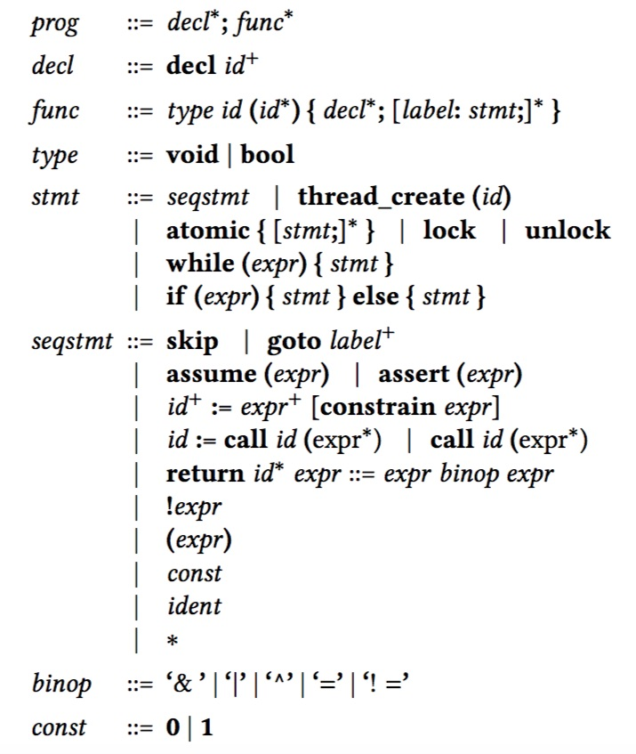

<html>

  <body>
      

    
The direct input to CUBA are concurrent pushdown systems (CPDS), a model
      described in Section 3 of our paper. (CPDS are
      translated from concurrent (recursive) Boolean
      programs. Boolean programs are in turn
      obtained from concurrent <code>C/C++</code> or Java programs by predicate
      abstraction. We do not include resources for these translation steps in this artifact.)
    

   <!-- Example -->
    <h4>1. Syntax of Boolean Programs</h4>
    
    <h4>2. Syntax of Concurrent Pushdown Systems (CPDS)</h4>
	
The syntax of CPDS is briefly summarized as follows (refer to Section 3 of the
	  <!--a href="./paper.pdf">paper</a-->
	  paper for more details):

    <ul>
      <li><b># of shared states:</b> the number given in the first (non-commented) line. Calling that number <code>s</code>, the set of shared states is <code>{0,...,s-1}</code>.</li> 
      <li><b>thread programs</b>: the program of a new thread is introduced by the terminal symbol <code>PDA</code>.</li> 
      <li><b>set of local states</b>: defined by two numbers <code>l1,l2</code> after the symbol <code>PDA</code>. The local states for the thread currently being defined are then <code>{l1,...,l2}</code>.</li> 
      <li><b>actions</b>: there are three types, classified by what they do to the stack of the thread, although each action also allows the modification of the shared state:
	<ul>
	  <li><code>s1 l1 -> s2 l2     </code>: <b>overwrite</b> the local state</li>
	  <li><code>s1 l1 -> s2 l2 l3</code>: <b>push</b> a new stack frame (also modifies of the current local state)</li>
	  <li><code>s1 l1 -> s2 -    </code>: <b>pop</b> a stack frame</li> 
	</ul>
      </li>
      </ul>
   <!-- Example -->
    <h4>3. Example</h4>
    

      The following shows a Boolean program (left) and its translated pushdown system (right). (Recall that the input to CUBA is the pushdown system;
      we show the Boolean program for illustration purposes only.)
    

    

      

	<pre>
// shared variable
 decl x;

// Thread 1 will run foo
 void foo() {
    if (*)
      call foo();
    while (x) {
    }
    x := true;
 }

// Thread 2 will run bar
 void bar() {
    if (*)
      call bar();
    while (!x) {
    }
    x := false;
 }

// program entry point
 void main() {
    create_thread(&foo);
    create_thread(&bar);
 }

	</pre>
      

      

	<pre>
2 # shared state 0..1
# Thread 1
PDA 2 5 # a PDA converted from foo
0 2 -> 0 3 # an overwrite action
1 2 -> 1 3
0 2 -> 0 4
1 2 -> 1 4
0 3 -> 0 2 4 # a push action
1 3 -> 1 2 4
0 4 -> 0 5
1 4 -> 1 4
0 5 -> 1 6
1 5 -> 1 6
0 6 -> 1 - # a pop action, "-" = empty
1 6 -> 1 -
# Thread 2
PDA 6 9 #  a PDA converted from bar
0 6 -> 0 7
1 6 -> 1 7
0 6 -> 0 8
1 6 -> 1 8
0 7 -> 0 6 8
1 7 -> 1 6 8
0 8 -> 0 8
1 8 -> 1 9
0 9 -> 0 10
1 9 -> 0 10
0 10 -> 0 -
1 10 -> 0 -</pre>
      

    

      

  </body>
</html>
