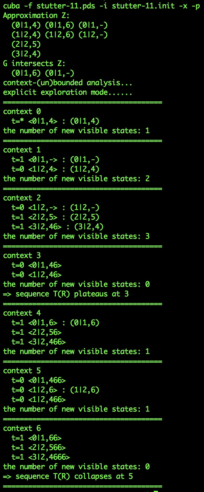
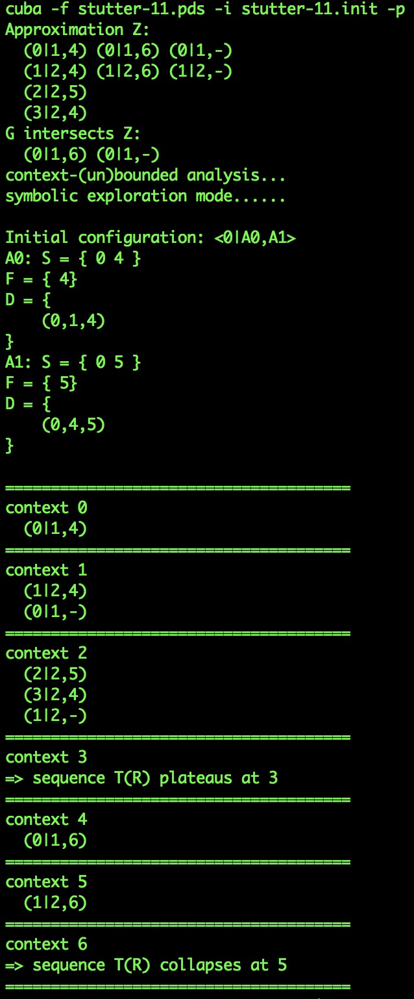
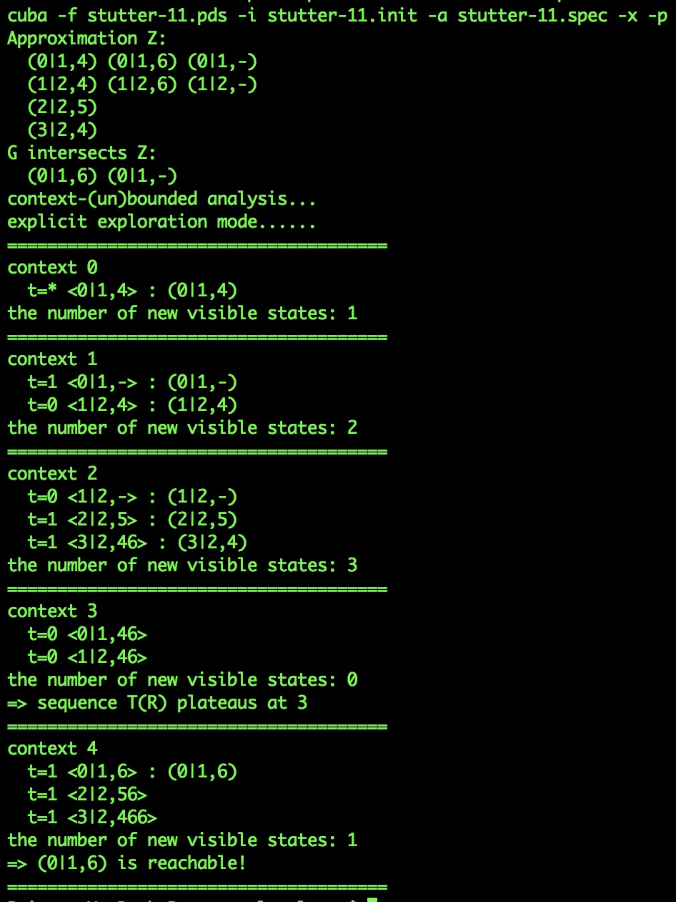
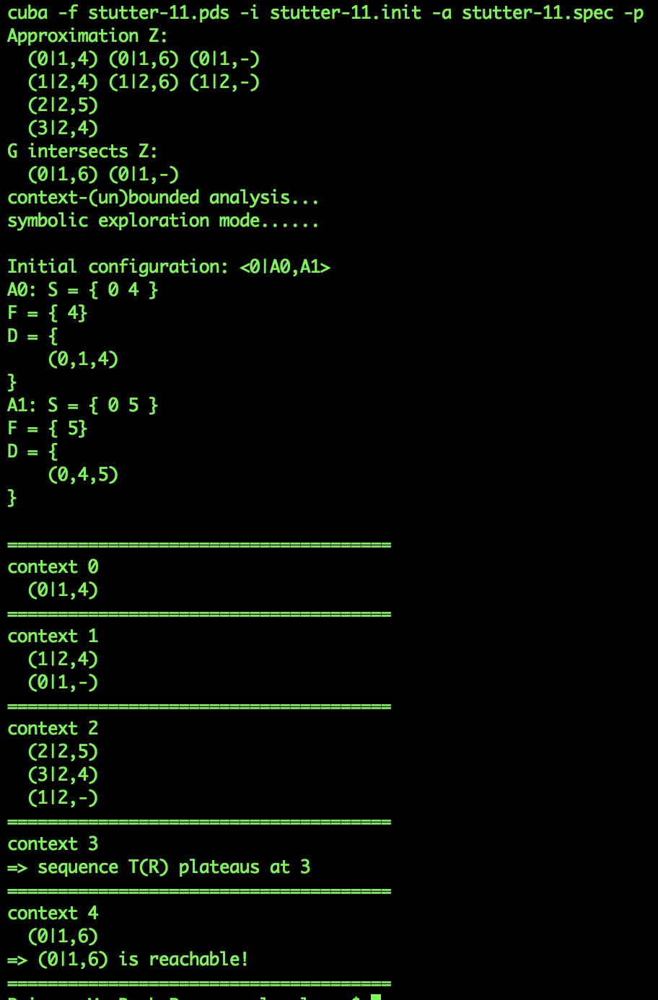

<html>
  <body>
  	
To have the CUBA executable readily available, we suggest you add <code>cuba</code> to your PATH variable.
    

	<h4>1. Help Info</h4>
	

	The following command prints usage help info:
	<pre><code>cuba -h</code></pre>
      We illustrate tool usage through the simple example <a href="../stutter-11.pds" download="stutter-11.pds">stutter-11.pds</a>,
	included <a href="https://github.com/lpzun/cuba/tree/pldi/examples">here</a>.
	  Let the initial state be <code>0|1,4</code>. You can either input the initial state directly via the command line, or
	store it in a file like <a href="../stutter-11.init" download="stutter-11.init">stutter-11.init</a> and pass the file to CUBA (we
	show both ways below).
	  Similarly, we have a target state <code>0|1,6</code> and a file named <a href="../stutter-11.spec" download="stutter-11.spec">stutter-11.spec</a>. 
	  The <b>reachability</b> of the target state represents the property of interest. 
	

	<h4>2. Run explicit CUBA</h4>
	<b><i>Computation of <b>all</b> reachable visible states</i>:</b>
	<pre><code>cuba -f stutter-11.pds -i "0|1,4" -x -p</code></pre>
	or 
	<pre><code>cuba -f stutter-11.pds -i stutter-11.init -x -p</code></pre>
	<b><i>Reachability of a given target visible state</i>:</b>
	<pre><code>cuba -f stutter-11.pds -i "0|1,4" -a "0|1,6" -x -p</code></pre>
	or 
	<pre><code>cuba -f stutter-11.pds -i stutter-11.init -a stutter-11.spec -x -p</code></pre>
	<b><i>Explanation</i>:</b>
	<ul>
	  <li><code>-f</code>, <code>-i</code>: pass the input program to the tool.</li>
	  <li><code>-a</code>: pass the target <i>visible</i> state to the tool.</li> 
	  <li><code>-x</code>: launch <i>explicit</i> exploration (see below).</li>
	  <li><code>-p</code>: print output, including states and visible states, in each round. The output for <code>stutter-11.pds</code> is shown below (left).</li>
	</ul>
	<b><i>Remark</i>:</b> the <code>-x</code> flag will cause an error
	    message if the input does not satisfy the <i>Finite-Context Reachability</i> condition, which
	    ensures that the set of states reachable <i>per
	    round</i> is finite and can therefore be explicitly enumerated.
	    See Section 5 of the <!--a href="./paper.pdf">paper</a-->paper for
	    details.
	<!-- , as the executation will never terminate if so. -->
	<h4>3. Run symbolic CUBA</h4>
	<b><i>Computation of <b>all</b> reachable visible states</i>:</b>
	<!-- Run CUBA with the following command for <b>symbolic</b> exploration: -->
	<pre><code>cuba -f stutter-11.pds -i "0|1,4" -p</code></pre>
	or 
	<pre><code>cuba -f stutter-11.pds -i stutter-11.init -p</code></pre>
	<b><i>Reachability of a given target state</i>:</b>
	<!-- 
 -->
	<!-- Run CUBA with the following command to determine the reachability of a given state:  -->
	<pre><code>cuba -f stutter-11.pds -i "0|1,4" -a "0|1,6" -p</code></pre>
	or 
	<pre><code>cuba -f stutter-11.pds -i stutter-11.init -a stutter-11.spec -p</code></pre>
	<b><i>Explanation</i>:</b>
	<ul>
	  <li><code>-p</code>: print the output, include visible states in each round. The output for <code>stutter-11.pds</code> is shown below (right).</li>
	</ul>
	<h4>Output</h4>
	<b><i>Convergence detection</i>:</b>
	

	  

	    
<i>Explicit Exploration (with <code>-x</code>, <code>-p</code> flags)</i>

	    
	  

	  

	    
<i>Symbolic Exploration (without <code>-x</code> flag)</i>

	    
	  

	

	 
	<b><i>Reachability of the target state <code>0|1,6</code></i>:</b>
	

	  

	    
<i>Explicit Exploration (with <code>-x</code>, <code>-p</code> flags)</i>

	    
	  

	  

	    
<i>Symbolic Exploration (without <code>-x</code> flag)</i>

	    
	  

	

  </body>
</html>
