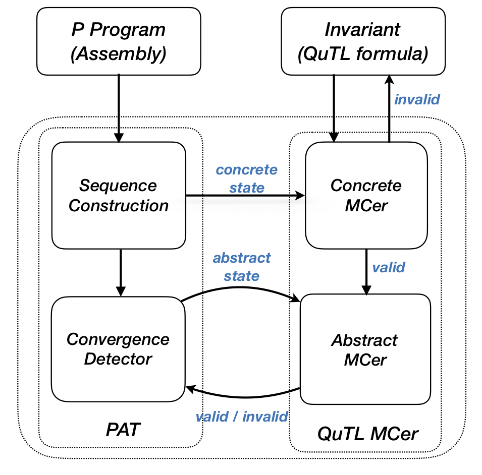

<h3>1. Design Description</h3>

    

        
<i>An overview of PAT</i>

        <!--object width="400" height="450" data="design.pdf"></!--object-->
        
    

    The above figure demonstrates the architecture of our tool. It contains two
    components: PAT and QuTL MCer.
    <ul>
        <li>
            PAT implements the core idea of our approach (Algorithm 1, Section 4 of the paper). It contains two main procedures:
            the <b>observation sequence construction</b> using list abstraction, and the <b>convergence detection</b>
            using the partial abstract transformer.
        </li>
         
        <li>
            QuTL MCer (QuTL model checker) implements the QuTL model checking algorithms
            (Section 5 of the paper). When enabled, it is used to filter spurious abstract states in the process of
            convergence detection. It contains two main procedures: a <b>concrete MCer</b> is called on
            concrete states in the process of sequence construction. Its main purpose is to test
            whether the input invariant is valid or not, on the states reached up to the bound. If the concrete MCer reports a violation,
            then the user has to rewritten the invariant. Otherwise, the invariant will be fed
            to <b>abstract MCer</b> to filter infeasible abstract states -- those that violate the invariant (see paper for meaning).
        </li>
    </ul>

    <b>Usage:</b> To use our tool, the users first need to compile a P program, which is done via P compiler
    (See tutorial and Section 6 of the paper for more details). Then, our tool will run the verification on the compiled P program.
    Our tool provides rich features to perform verification. Two main features are presented as follows:
    <ul>
        <li>
            <code>/queue-prefix:p</code>:: to verify a P program by specifying an
            unabstracted prefix of queues.
        </li>
         
        <li>
            <code>/qutl:formula</code>:: to verify a P program using the QuTL MCer.
        </li>
    </ul>
    The two features can be used simultanously.

<h3>2. Programmer's Guide</h3>

    See <a href="../quba-doc/Help/index.html">here</a> for the off-the-shelf programmer's guide in <b>html</b> format.

    We included a SandCastle project in directory <code>doc</code> to help users (re-)generate the programmer's guide with <b>SandCastle</b> help file builder.

