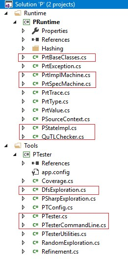

<html>
<body>
<h3>We include</h3>

    <ul>
        <li>source code in the the subdirectory <code>artifact/src/</code> (for browsing the source. For installation, see below).</li>
         
        <li>executable binaries in the subdirectory <code>artifact/bin</code> (for platform <code>x64 Windows 10</code>): </li>
    </ul>
    <b>Note:</b>
    <ul>
        <li>The following assumes you have entered the top-level of the <code>artifact</code> directory tree.</li>
         
        <li>The <code>Tutorial</code> tab contains more details about running the tool.</li>
    </ul>

<h3>1. Source Code </h3>

    <b><i>Note:</i></b>
    Our tool is built atop <a href="https://github.com/p-org/P">P</a>, which is an open source project contributed
    by the developers from <b>Microsoft Research</b> and <b>UC Berkeley</b>. So, our tool heavily depends on other
    parts or libraries of P.
    <h4>1.1 The most relevant code</h4>
    

        The code base of P is so large that we included only the source code of the most relevant sub-projects in <code>src/</code>.
        We also highlighted the most interesting parts in those sub-projects in the following figure.
    

    

        

            
<i>Source code tree (shown in Visual Studio 2017)</i>

            
        

    

    <h4>1.2 Check out the entire code base from GitHub</h4>
    

        Use the following command to check out the entire code of P:
        <pre>git clone -b StateHashing --single-branch https://github.com/p-org/P.git </pre>
    

    <b><i>Note:</i></b>
    The implementation of our tool is in the <code>StateHashing</code> branch.

<h3>2. Installation </h3>

    <h4>2.1 Install from source</h4>
    

        <b><i>Prerequisite:</i></b>
        To install our tool from source code, you first need to install P on your machine.
    

    

        Use the above command to check out the source code and then follow the instruction on the <a href="https://github.com/p-org/P/wiki/Build-P-on-Windows">wiki page</a> of P.
    

    

        <b><i>Warning:</i></b>
        It will take some efforts to successfully install P. This is not required to reproduce our results; you can rely on the binaries instead.
    

    <h4>2.2 Use the binaries</h4>
    

        Open a command line and run the following commands, for testing executability.
        <pre>
cd bin/x64/Binaries
./pt.exe /h</pre>
            

        

</body>
</html>
